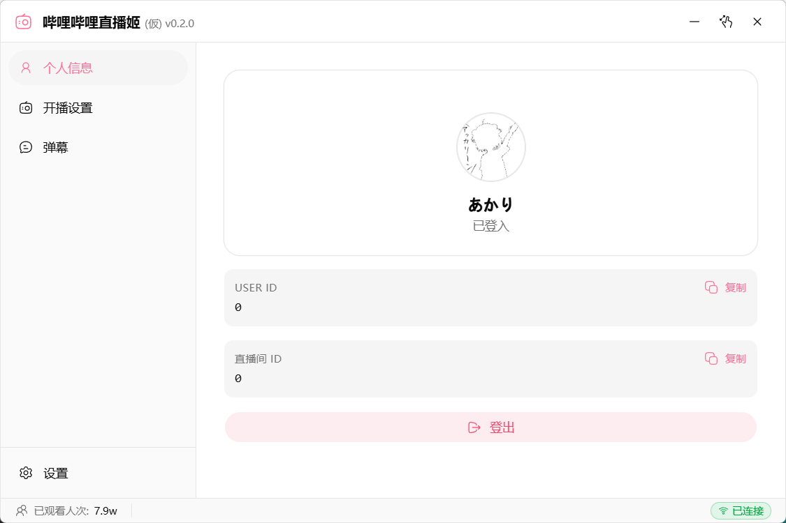
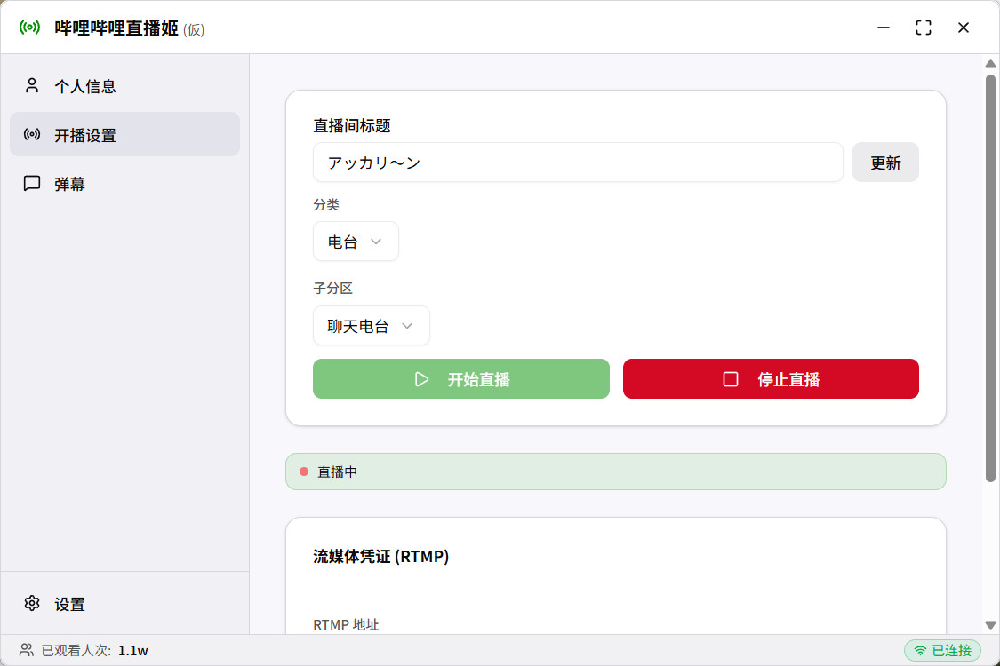
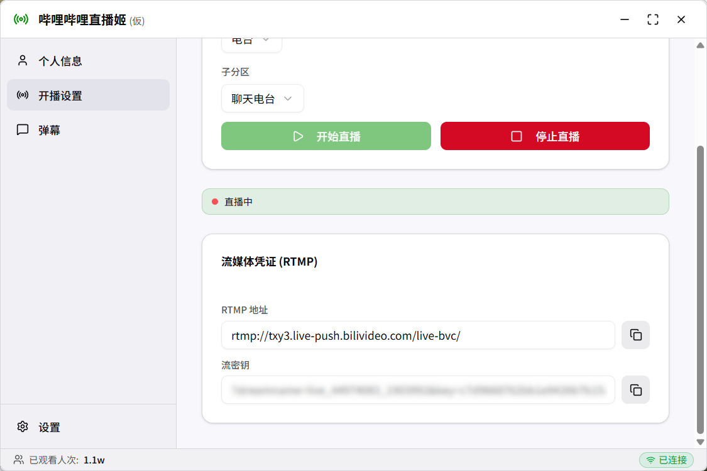
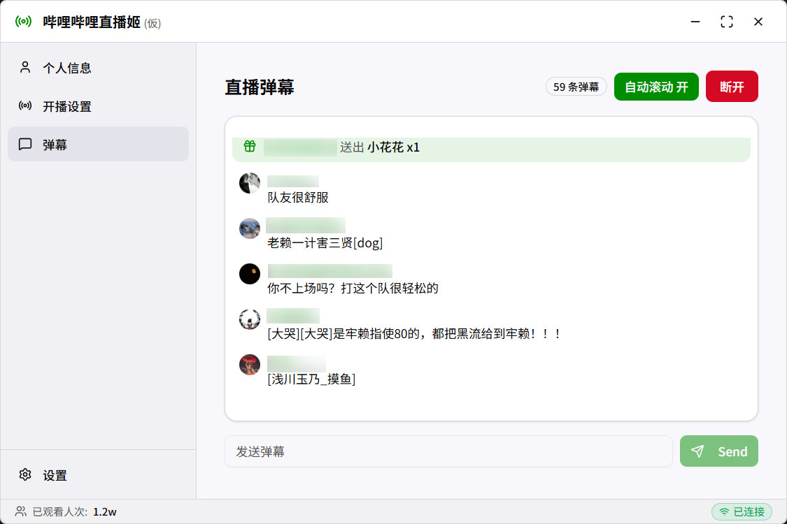

# 哔哩哔哩直播姬（仮）
[](https://github.com/Rsplwe/bili-live-hime/blob/main/LICENSE) [](https://github.com/Rsplwe/bili-live-hime/actions/workflows/publish-to-manual-release.yml)

官方直播姬的轻量化、跨平台替代工具，支持 Windows / Linux / MacOS。

## 已支持的功能
- [x] 获取 RTMP / SRT 推流地址及流密钥
- [x] 支持直播间信息修改 （标题、分区）  
- [x] 直播间弹幕推送
- [x] 观众进入提示
- [x] 打赏礼物推送
- [x] 观众人次统计
- [x] 弹幕发送
- [x] 夜间模式
- [x] SuperChat 提示

## TODO

- [ ] 大航海加入提示 
- [ ] 房间管理
  - [ ] 房管设置
  - [ ] 禁言设置
  - [ ] 黑名单设置
  - [ ] 屏蔽词

## 截图
<p align="center">
  
  
</p>
<p align="center">
  
  
</p>

## 使用说明
1. 登入哔哩哔哩账号（扫码 / Cookie）
2. 获取直播间推流地址与流密钥
3. 将推流信息填入 OBS / 其他推流软件

## 下载

### 预编译版本
* [Release](https://github.com/Rsplwe/bili-live-hime/releases/latest)

### 从源码运行

#### 构建依赖
- **Node.js** ≥ 18  
- **Rust**（stable）

#### Clone
```bash
git clone https://github.com/Rsplwe/bili-live-hime.git
cd bili-live-hime
npm install
```

#### 开发模式
```bash
npm run tauri dev
```

#### 构建发布版本
```bash
npm run tauri build
```
构建产物位于：
`src-tauri/target/release/` 或 `src-tauri/target/release/bundle/`

## 参考项目
- [**SocialSisterYi/bilibili-API-collect**](https://github.com/SocialSisterYi/bilibili-API-collect)